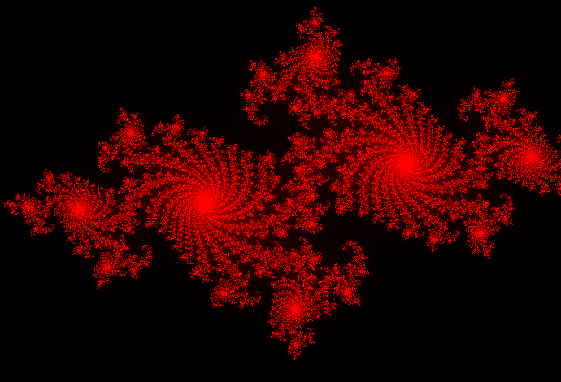

Mandelbrot
==========

Mandelbrot and Julia set family viewer written in Scala.

Controls:

- arrows: pan the view
- <kbd>,</kbd> and <kbd>.</kbd>: zoom
- <kbd>/</kbd>: change the color scheme
- <kbd>;</kbd> and <kbd>'</kbd>: change the precision of the calculations
- <kbd>1</kbd>, <kbd>2</kbd> and <kbd>3</kbd>: change the displayed
  set (Mandelbrot, Julia `-0.73+0.19i` and The Burning Ship)
- <kbd>q</kbd>: quit

COMPILATION
-----------

    sbt run      # run once
    sbt package  # build the .jar package

DEPENDENCIES
------------

- Scala
- sbt

COPYRIGHT
---------

Copyright (C) 2015  Wojciech Siewierski

This program is free software: you can redistribute it and/or modify
it under the terms of the GNU General Public License as published by
the Free Software Foundation, either version 3 of the License, or
(at your option) any later version.

This program is distributed in the hope that it will be useful,
but WITHOUT ANY WARRANTY; without even the implied warranty of
MERCHANTABILITY or FITNESS FOR A PARTICULAR PURPOSE.  See the
GNU General Public License for more details.

You should have received a copy of the GNU General Public License
along with this program.  If not, see <http://www.gnu.org/licenses/>.
